# 🚀 Advanced Professional CMS  
*The Ultimate Content Management Ecosystem*

  
**Enterprise-Grade Content Management • Headless Architecture • AI-Powered Tools**

---

## 🎯 Overview Cards

<div align="center">

### 🏗️ Architecture
| Feature | Status | Version |
|---------|--------|---------|
| Headless CMS | ✅ Production Ready | v2.5 |
| GraphQL API | ✅ Stable | v2.1 |
| Real-time Updates | ✅ Live | v1.8 |
| Multi-tenant | ✅ Enterprise | v3.0 |

### 🌟 Core Features
| Module | Coverage | Performance |
|--------|----------|-------------|
| Content Management | 100% | ⚡⚡⚡⚡⚡ |
| Media Processing | 95% | ⚡⚡⚡⚡⚡ |
| User Management | 100% | ⚡⚡⚡⚡⚡ |
| API Ecosystem | 98% | ⚡⚡⚡⚡⚡ |

</div>

---

## ✨ Animated Feature Highlights

<div align="center">

### 🎨 **Content Authoring** → **🤖 AI Enhancement** → **🚀 Multi-channel Publishing**
### 🔧 **Developer First** → **⚡ API Driven** → **🌐 Omnichannel Ready**
### 🛡️ **Enterprise Security** → **📊 Advanced Analytics** → **🎯 Personalization**

</div>

---

## 🏆 Featured Capabilities


---

# 📚 Comprehensive Documentation

## 🎮 Quick Start

```bash
# Clone repository
git clone https://github.com/your-org/advanced-cms.git

# Install dependencies
npm install

# Start development server
npm run dev

# Access CMS
http://localhost:3000/admin
```

## 🛠️ Installation

<div class="card-grid">
<div class="card">

### 🐳 Docker Setup
```yaml
version: '3.8'
services:
  cms:
    image: advanced-cms:latest
    ports:
      - "3000:3000"
    environment:
      - NODE_ENV=production
```

</div>
<div class="card">

### ☁️ Cloud Deployment
```bash
# Deploy to AWS
npm run deploy:aws

# Deploy to Google Cloud
npm run deploy:gcp

# Deploy to Azure
npm run deploy:azure
```

</div>
</div>

---

## 🎨 UI/UX Showcase

### 🖱️ Interactive Demo
> **Experience our live demo**: [demo.advanced-cms.com](https://demo.advanced-cms.com)  
> **Admin Credentials**: `demo@advanced-cms.com` / `demo123`

### 📱 Responsive Design


---

## 🔌 Integration Ecosystem

<div class="integration-grid">

### 🤖 AI Services


### ☁️ Cloud Platforms


### 🔗 APIs & Services


</div>

---

## 📊 Performance Metrics

<div align="center">

| Metric | Value | Status |
|--------|-------|--------|
| 🚀 API Response Time | < 100ms | ✅ Excellent |
| 📈 Uptime | 99.99% | ✅ Stable |
| 🗃️ Content Delivery | < 2s | ✅ Fast |
| 🔄 Cache Efficiency | 95% | ✅ Optimal |

</div>

---

## 🎯 Use Cases

<div class="use-case-cards">

<div class="use-case-card">

### 🏢 Enterprise
- **Multi-site Management**
- **Enterprise Security**
- **Advanced Workflows**
- **Compliance Ready**

</div>
<div class="use-case-card">

### 🛒 E-commerce
- **Product Catalogs**
- **Personalized Shopping**
- **Order Management**
- **Inventory Sync**

</div>
<div class="use-case-card">

### 📰 Publishing
- **Multi-channel Content**
- **Editorial Workflows**
- **Real-time Analytics**
- **Audience Engagement**

</div>

</div>

---

## 🔄 Real-time Features

```javascript
// Real-time content updates
cms.subscribe('content.updated', (data) => {
  console.log('Content updated in real-time:', data);
  updateLivePreview(data);
});

// Collaborative editing
cms.collaborate('document-123', (users) => {
  showLiveCursors(users);
});
```

---

## 🛡️ Security & Compliance

<div class="security-badges">


</div>

### 🔒 Security Features
- **End-to-end Encryption**
- **Multi-factor Authentication**
- **Role-based Access Control**
- **Audit Logging**

---

## 🚀 Getting Started Guide

### 1. **Environment Setup**
```bash
# Copy environment configuration
cp .env.example .env

# Configure your settings
nano .env
```

### 2. **Database Setup**
```bash
# Run migrations
npm run db:migrate

# Seed initial data
npm run db:seed
```

### 3. **Start Development**
```bash
# Start all services
npm run dev:all

# Or start individually
npm run dev:api
npm run dev:admin
npm run dev:frontend
```

---

## 📈 Roadmap

### 🟢 Q1 2024 - Completed
- [x] Headless Architecture
- [x] GraphQL API
- [x] Real-time Collaboration

### 🟡 Q2 2024 - In Progress
- [ ] AI Content Enhancement
- [ ] Advanced Personalization
- [ ] Blockchain Integration

### 🔵 Q3 2024 - Planned
- [ ] Voice Interface
- [ ] AR/VR Content
- [ ] Quantum-safe Encryption

---

## 🤝 Community & Support

<div align="center">

### 📞 Support Channels
| Channel | Availability | Response Time |
|---------|--------------|---------------|
| 📧 Email Support | 24/7 | < 2 hours |
| 💬 Community Chat | Always | Real-time |
| 🐛 GitHub Issues | Business Hours | < 4 hours |
| 📚 Documentation | Always | Instant |

### 🌐 Join Our Community
[](https://discord.gg/advanced-cms)
[](https://github.com/your-org/advanced-cms)
[](https://twitter.com/advancedcms)

</div>

---

## 📄 License

```text
MIT License - Commercial Friendly
Copyright (c) 2024 Advanced CMS Team

Permission is hereby granted, free of charge, to any person obtaining a copy
of this software and associated documentation files (the "Software"), to deal
in the Software without restriction, including without limitation the rights
to use, copy, modify, merge, publish, distribute, sublicense, and/or sell
copies of the Software, and to permit persons to whom the Software is
furnished to do so, subject to the following conditions...

For full license details, see LICENSE file.
```

---

<div align="center">

## 🎊 Ready to Transform Your Content Management?

[](https://advanced-cms.com/trial)
[](https://docs.advanced-cms.com)
[](https://demo.advanced-cms.com)

**⭐ Star us on GitHub if you find this project useful!**

</div>

---

*Built with ❤️ by the Advanced CMS Team • [Contribute](https://github.com/your-org/advanced-cms/blob/main/CONTRIBUTING.md) • [Report Bug](https://github.com/your-org/advanced-cms/issues)*
# Advanced Professional CMS: Comprehensive Feature Taxonomy

## 1. Core Content Management
### 1.1 Content Authoring & Editing
- **WYSIWYG Editor**
  - In-line editing capabilities
  - Markdown support
  - Advanced formatting toolbar
  - Drag-and-drop content blocks
  - Real-time collaborative editing
- **Content Drafting**
  - Auto-save functionality
  - Version history with diffs
  - Draft/published state management
- **Media Integration**
  - In-editor media embedding
  - Asset library access
  - Responsive image handling

### 1.2 Content Modeling & Architecture
- **Content Types**
  - Custom type builder
  - Field type library (text, rich text, number, date, boolean, reference, media, JSON)
  - Validation rules engine
  - Conditional field display
- **Taxonomy Management**
  - Hierarchical categories
  - Tagging system
  - Custom taxonomy types
  - Taxonomy-based filtering
- **Relationship Management**
  - Content reference fields
  - Bi-directional relationships
  - Relationship cardinality control

### 1.3 Workflow & Governance
- **Editorial Workflows**
  - Custom workflow states
  - Role-based approval chains
  - Content scheduling
  - Expiration automation
- **Content Lifecycle**
  - Review cycles
  - Archive policies
  - Content retirement rules
- **Change Management**
  - Change request system
  - Audit trail logging
  - Rollback capabilities

## 2. User & Access Management
### 2.1 Authentication & Security
- **Authentication Methods**
  - Multi-factor authentication (MFA)
  - Single Sign-On (SSO) - SAML, OIDC
  - Social login integration
  - API key management
- **Security Protocols**
  - Role-based access control (RBAC)
  - Attribute-based access control (ABAC)
  - IP whitelisting
  - Session management

### 2.2 User Management
- **User Profiles**
  - Custom user fields
  - Preference management
  - Activity dashboards
- **Team Management**
  - Team-based permissions
  - Departmental structuring
  - Bulk user operations

## 3. Media & Digital Asset Management
### 3.1 Asset Processing
- **Image Optimization**
  - Automatic format conversion (WebP, AVIF)
  - Responsive image generation
  - Compression algorithms
  - Lazy loading support
- **Video Processing**
  - Transcoding services
  - Adaptive bitrate streaming
  - Thumbnail generation
  - Subtitle support

### 3.2 Asset Organization
- **Metadata Management**
  - EXIF data extraction
  - Custom metadata schemas
  - Bulk metadata editing
- **Digital Asset Management**
  - Advanced search with filters
  - Collection management
  - Usage tracking
  - Rights management

## 4. Technical Architecture
### 4.1 API & Integration Layer
- **API Types**
  - RESTful API with HATEOAS
  - GraphQL endpoint
  - Real-time WebSocket API
  - Webhook system
- **API Management**
  - Rate limiting
  - API versioning
  - Request logging
  - Documentation auto-generation

### 4.2 Headless Architecture
- **Content Delivery**
  - Content Delivery Network (CDN) integration
  - Edge caching strategies
  - Multi-region deployment
- **Frontend Agnosticism**
  - Framework-agnostic SDKs
  - Preview functionality
  - Static site generation support

## 5. Developer Experience
### 5.1 Development Tools
- **CLI & DevOps**
  - Command-line interface
  - Docker containerization
  - CI/CD pipeline integration
- **Development Features**
  - Webhook simulator
  - API playground
  - Environment management

### 5.2 Extensibility
- **Plugin System**
  - Custom plugin architecture
  - Marketplace ecosystem
  - Dependency management
- **Custom Applications**
  - App framework
  - UI extension points
  - Serverless function hosting

## 6. Performance & Scalability
### 6.1 Caching Strategy
- **Caching Layers**
  - Application-level caching
  - Database query caching
  - Object caching
  - Fragment caching
- **Cache Management**
  - Cache invalidation rules
  - Cache warming
  - Cache analytics

### 6.2 Infrastructure
- **Scalability Features**
  - Auto-scaling capabilities
  - Load balancing
  - Database replication
- **Performance Optimization**
  - Asset minification
  - Code splitting
  - Database indexing

## 7. Internationalization & Localization
### 7.1 Multi-language Support
- **Translation Management**
  - Translation interface
  - Machine translation integration
  - Translation memory
  - Glossary management
- **Locale Management**
  - Regional formatting
  - Timezone handling
  - RTL language support

### 7.2 Global Deployment
- **Regional Content**
  - Geo-targeting rules
  - Localization workflows
  - Regional compliance

## 8. Personalization & Targeting
### 8.1 User Segmentation
- **Segment Builder**
  - Demographic targeting
  - Behavioral targeting
  - Geographic targeting
  - Custom attribute targeting
- **Personalization Rules**
  - Content variation engine
  - A/B testing framework
  - Multivariate testing

### 8.2 Experience Management
- **Dynamic Content**
  - Personalization rules engine
  - Real-time content adaptation
  - Predictive content delivery

## 9. Analytics & Insights
### 9.1 Content Analytics
- **Performance Metrics**
  - Engagement tracking
  - Conversion tracking
  - Content effectiveness
- **User Analytics**
  - User journey mapping
  - Behavior flow analysis
  - Retention metrics

### 9.2 Business Intelligence
- **Reporting Engine**
  - Custom report builder
  - Scheduled reporting
  - Data export capabilities
- **Dashboard System**
  - Customizable dashboards
  - Real-time analytics
  - KPI monitoring

## 10. SEO & Digital Marketing
### 10.1 SEO Tools
- **On-page SEO**
  - Meta tag management
  - Structured data markup
  - Canonical URL management
  - XML sitemap generation
- **SEO Analysis**
  - Content gap analysis
  - Keyword tracking
  - Competitor analysis

### 10.2 Marketing Integration
- **Campaign Management**
  - UTM parameter tracking
  - Campaign performance
  - Landing page management
- **Marketing Automation**
  - Lead capture forms
  - Email marketing integration
  - CRM synchronization

## 11. E-commerce Capabilities
### 11.1 Product Management
- **Catalog Management**
  - Product variants
  - Inventory tracking
  - Pricing rules
- **Order Management**
  - Shopping cart functionality
  - Checkout customization
  - Order workflow

### 11.2 Commerce Features
- **Payment Integration**
  - Multiple gateway support
  - Subscription billing
  - Tax calculation
- **Customer Management**
  - Customer profiles
  - Order history
  - Loyalty programs

## 12. Compliance & Security
### 12.1 Data Protection
- **Privacy Compliance**
  - GDPR compliance tools
  - CCPA/CPRA compliance
  - Data anonymization
  - Consent management
- **Data Security**
  - Encryption at rest & transit
  - Data backup & recovery
  - Security auditing

### 12.2 Enterprise Security
- **Access Security**
  - Security policy enforcement
  - Compliance reporting
  - Security incident response

## 13. Integration Ecosystem
### 13.1 Third-party Integrations
- **Marketing Tools**
  - Email service providers
  - Marketing automation platforms
  - Analytics platforms
- **Business Systems**
  - CRM integration
  - ERP connectivity
  - HR system integration

### 13.2 Custom Integration
- **Integration Framework**
  - Custom connector builder
  - Data synchronization engine
  - Event-driven architecture

## 14. Administration & Operations
### 14.1 System Management
- **Administration Panel**
  - System health monitoring
  - Performance metrics
  - Log management
- **Configuration Management**
  - Environment configuration
  - Feature flags
  - System settings

### 14.2 Maintenance Tools
- **Data Management**
  - Bulk operations
  - Data import/export
  - Database maintenance
- **System Maintenance**
  - Backup scheduling
  - Update management
  - Disaster recovery

## 15. Omnichannel Delivery
### 15.1 Multi-channel Publishing
- **Channel Management**
  - Web channel optimization
  - Mobile app content delivery
  - Social media syndication
- **Content Syndication**
  - RSS/Atom feeds
  - Content API for partners
  - Syndication analytics

### 15.2 Emerging Channels
- **Voice & AI**
  - Voice skill content optimization
  - Chatbot content feeds
- **IoT & Devices**
  - Smart device content
  - Digital signage management

## 16. AI & Automation
### 16.1 Intelligent Features
- **AI-powered Tools**
  - Content generation assistance
  - Automated tagging & categorization
  - Content quality analysis
- **Process Automation**
  - Workflow automation
  - Content personalization AI
  - Predictive analytics

### 16.2 Machine Learning
- **ML Capabilities**
  - Recommendation engines
  - Anomaly detection
  - Pattern recognition
  - Automated optimization
# Advanced Professional CMS: Additional Comprehensive Features

## 1. Advanced Content Operations
### 1.1 Content Orchestration
- **Content Federation**
  - Multi-instance content synchronization
  - Federated search across instances
  - Cross-instance content relationships
- **Content Virtualization**
  - Virtual content composites
  - Dynamic content assembly
  - Real-time content transformation

### 1.2 Advanced Publishing
- **Multi-stage Publishing**
  - Blue-green deployment for content
  - Canary content releases
  - Progressive content rollout
- **Content Propagation**
  - Multi-region content sync
  - Edge location content deployment
  - Content pre-warming strategies

## 2. Advanced Developer Ecosystem
### 2.1 Development Infrastructure
- **CMS-as-Code**
  - Git-based content model versioning
  - Infrastructure as Code (IaC) templates
  - Configuration drift detection
- **Developer Sandboxes**
  - Isolated development environments
  - Feature branch previews
  - Automated testing environments

### 2.2 Advanced APIs
- **Real-time APIs**
  - WebSocket subscriptions for content changes
  - Server-sent events for live updates
  - Real-time collaboration APIs
- **Bulk Operations API**
  - Batch content operations
  - Async job processing
  - Bulk import/export with validation

## 3. Enterprise Governance
### 3.1 Advanced Compliance
- **Records Management**
  - Content retention policies
  - Legal hold capabilities
  - eDiscovery integration
- **Regulatory Compliance**
  - HIPAA compliance tools
  - SOX compliance reporting
  - Industry-specific compliance packs

### 3.2 Enterprise Security
- **Advanced Threat Protection**
  - Behavioral anomaly detection
  - Content-level security scanning
  - Malware detection in uploads
- **Data Loss Prevention**
  - Content exfiltration prevention
  - Watermarking capabilities
  - Digital rights management (DRM)

## 4. Advanced Media Management
### 4.1 AI-Powered Media
- **Computer Vision**
  - Automatic object recognition
  - Facial recognition and blurring
  - Scene detection and tagging
- **Media Intelligence**
  - Content-aware cropping
  - Automatic alt-text generation
  - Media similarity detection

### 4.2 Advanced Video
- **Interactive Video**
  - Video chapter markers
  - Interactive hotspots
  - Video analytics integration
- **Live Streaming**
  - Live stream management
  - Real-time closed captions
  - Stream recording and archiving

## 5. Performance & Infrastructure
### 5.1 Advanced Caching
- **Intelligent Caching**
  - Predictive content caching
  - User-specific cache variations
  - Cache warming automation
- **Edge Computing**
  - Edge function execution
  - Dynamic edge configuration
  - Edge-side includes (ESI)

### 5.2 Advanced Monitoring
- **Observability Stack**
  - Distributed tracing
  - Application performance monitoring
  - Real-user monitoring (RUM)
- **Predictive Analytics**
  - Capacity forecasting
  - Performance anomaly detection
  - Automated scaling recommendations

## 6. Content Intelligence
### 6.1 Content Analytics
- **Advanced Content Scoring**
  - Content quality scoring
  - SEO effectiveness scoring
  - Engagement prediction scoring
- **Content Gap Analysis**
  - Topic coverage analysis
  - Competitive content analysis
  - Audience interest mapping

### 6.2 Semantic Content
- **Knowledge Graph**
  - Entity extraction and linking
  - Semantic relationship mapping
  - Contextual content recommendations
- **Natural Language Processing**
  - Sentiment analysis
  - Content summarization
  - Language detection and routing

## 7. Advanced Personalization
### 7.1 Real-time Personalization
- **Behavioral Targeting**
  - Real-time intent detection
  - Session-based personalization
  - Cross-device behavior tracking
- **Predictive Personalization**
  - Machine learning recommendations
  - Propensity modeling
  - Next-best-action engines

### 7.2 Experience Optimization
- **Multivariate Testing**
  - Multi-armed bandit testing
  - Personalization algorithm testing
  - Automated optimization
- **Journey Orchestration**
  - Cross-channel journey mapping
  - Real-time journey optimization
  - Journey analytics

## 8. Advanced E-commerce
### 8.1 Commerce Intelligence
- **Product Experience Management**
  - 3D product visualization
  - Augmented reality product views
  - Product configuration management
- **Commerce Analytics**
  - Product performance analytics
  - Cart abandonment analysis
  - Customer lifetime value tracking

### 8.2 Advanced Order Management
- **Distributed Order Management**
  - Multi-location inventory
  - Ship-from-store capabilities
  - Global tax and duty calculation
- **Subscription Management**
  - Recurring billing engine
  - Usage-based pricing
  - Subscription lifecycle management

## 9. Advanced Integration
### 9.1 Enterprise Integration
- **Event-Driven Architecture**
  - Event sourcing capabilities
  - Complex event processing
  - Event replay and debugging
- **Data Pipeline Integration**
  - ETL process integration
  - Real-time data streaming
  - Data warehouse synchronization

### 9.2 System Integration
- **Legacy System Integration**
  - Mainframe connectivity
  - AS/400 system integration
  - Custom protocol adapters
- **IoT Integration**
  - Sensor data ingestion
  - Device management
  - Real-time IoT analytics

## 10. Advanced Administration
### 10.1 Enterprise Operations
- **Multi-tenant Management**
  - Tenant isolation policies
  - Cross-tenant analytics
  - Tenant resource allocation
- **Cost Management**
  - Resource cost allocation
  - Usage-based billing
  - Cost optimization recommendations

### 10.2 Advanced Configuration
- **Policy Management**
  - Content governance policies
  - Security policies engine
  - Compliance policy enforcement
- **Workflow Automation**
  - Robotic Process Automation (RPA)
  - Business rule engine
  - Decision table management

## 11. Emerging Technologies
### 11.1 Blockchain Integration
- **Content Provenance**
  - Content authenticity verification
  - Immutable audit trails
  - Digital asset tokenization
- **Smart Contracts**
  - Automated royalty payments
  - Content usage rights enforcement
  - Automated compliance checking

### 11.2 Advanced AI/ML
- **Generative AI**
  - AI content generation
  - Style transfer capabilities
  - Automated content variations
- **Advanced ML Ops**
  - Model training pipelines
  - A/B testing for ML models
  - Model performance monitoring

## 12. Specialized Content Types
### 12.1 Structured Data Content
- **Database-driven Content**
  - Dynamic dataset management
  - Real-time data visualization
  - API-driven content aggregation
- **Form & Survey Management**
  - Dynamic form builder
  - Response analytics
  - Form logic and branching

### 12.2 Interactive Content
- **Calculator & Tool Management**
  - Interactive calculator builder
  - Result personalization
  - Tool usage analytics
- **Quiz & Assessment Engine**
  - Adaptive testing algorithms
  - Score calculation engines
  - Result interpretation logic

## 13. Advanced Delivery & Edge
### 13.1 Edge Computing
- **Edge Application Management**
  - Edge function deployment
  - Edge configuration management
  - Edge analytics collection
- **Edge Security**
  - Edge firewall rules
  - Bot detection at edge
  - Edge-side authentication

### 13.2 Advanced CDN
- **Intelligent Routing**
  - Performance-based routing
  - Cost-based routing
  - Compliance-based routing
- **Dynamic Content Optimization**
  - Real-time content adaptation
  - Device-specific optimization
  - Network-aware delivery

## 14. Quality & Testing
### 14.1 Content Quality
- **Automated Quality Assurance**
  - Broken link detection
  - Content freshness monitoring
  - Accessibility compliance scanning
- **Content Testing**
  - Automated content review
  - Style guide enforcement
  - Tone and voice analysis

### 14.2 Performance Testing
- **Load Testing Integration**
  - Automated performance testing
  - Stress testing capabilities
  - Chaos engineering integration
- **Quality Gates**
  - Performance budgets
  - Quality score thresholds
  - Automated quality checks

## 15. Advanced Analytics
### 15.1 Predictive Analytics
- **Forecasting Engine**
  - Content performance forecasting
  - Traffic prediction models
  - Resource requirement forecasting
- **Anomaly Detection**
  - Usage pattern anomaly detection
  - Security threat detection
  - Performance anomaly alerts

### 15.2 Business Analytics
- **ROI Calculation**
  - Content ROI analytics
  - Campaign ROI tracking
  - Investment optimization
- **Advanced Segmentation**
  - RFM analysis integration
  - Customer clustering
  - Behavioral cohort analysis

## 16. Specialized Workflows
### 16.1 Legal & Compliance
- **Legal Workflow Integration**
  - Legal review workflows
  - Compliance approval chains
  - Regulatory change management
- **Rights Management**
  - Digital rights tracking
  - Usage rights enforcement
  - Royalty calculation

### 16.2 Localization Engineering
- **Translation Technology**
  - Translation memory integration
  - Glossary management
  - Translation quality assessment
- **Global Deployment**
  - Regional compliance checking
  - Cultural adaptation tools
  - Local regulation compliance
# Advanced Professional CMS: Comprehensive UI/UX Components

## 1. Core Content Management Interfaces
### 1.1 Content Authoring UI
- **Visual Editor Components**
  - Floating format toolbar
  - Contextual formatting palette
  - Inline editing overlays
  - Drag-and-drop content blocks
- **Content Composition**
  - Component library sidebar
  - Layout builder canvas
  - Real-time preview panel
  - Content structure navigator

### 1.2 Content Listing & Management
- **Content Repository Views**
  - Kanban board view
  - Table view with sortable columns
  - Card/grid view
  - Tree hierarchy view
- **Advanced Filtering UI**
  - Faceted search filters
  - Saved filter presets
  - Quick filter chips
  - Advanced query builder

## 2. Dashboard & Analytics UI
### 2.1 Executive Dashboards
- **Overview Dashboards**
  - Customizable widget layout
  - Drag-and-drop dashboard builder
  - KPI metric cards
  - Real-time data visualizations
- **Performance Analytics**
  - Interactive charts and graphs
  - Data comparison views
  - Trend analysis visualizations
  - Goal tracking progress bars

### 2.2 Personal Dashboards
- **User-specific Views**
  - My tasks overview
  - Recent activity feed
  - Content performance widgets
  - Team collaboration panels

## 3. Navigation & Information Architecture
### 3.1 Global Navigation
- **Main Navigation Systems**
  - Mega menu navigation
  - Breadcrumb trails
  - Quick jump navigation
  - Command palette (Cmd+K)
- **Secondary Navigation**
  - Contextual action bars
  - Tabbed interface panels
  - Accordion sidebar menus
  - Floating action buttons

### 3.2 Workspace Navigation
- **Multi-panel Interfaces**
  - Split-view layouts
  - Tabbed document interface
  - Collapsible side panels
  - Modal overlays and drawers

## 4. Content Editing Interfaces
### 4.1 Advanced Editor UI
- **Rich Text Editing**
  - Bubble/floating menus
  - Slash command palette
  - Markdown shortcut overlay
  - Code block syntax highlighting
- **Media Editing Interfaces**
  - Image crop and edit overlay
  - Video trim and edit timeline
  - Media gallery grid selector
  - Asset properties inspector

### 4.2 Form & Input Interfaces
- **Field Input Components**
  - Conditional field displays
  - Multi-step form wizards
  - Inline validation messages
  - Auto-complete dropdowns
- **Advanced Input Types**
  - Color picker with presets
  - Date/time range pickers
  - Geo-location map picker
  - Rich select with search

## 5. Workflow & Collaboration UI
### 5.1 Editorial Workflow Interfaces
- **Workflow Visualization**
  - Process flow diagrams
  - Status timeline views
  - Approval chain visualization
  - Task dependency graphs
- **Collaboration Features**
  - Comment threads with mentions
  - Real-time presence indicators
  - Change suggestion overlays
  - @mention user autocomplete

### 5.2 Review & Approval UI
- **Content Review Tools**
  - Side-by-side comparison view
  - Change highlight overlays
  - Comment resolution workflow
  - Approval stamp interface

## 6. Media Management UI
### 6.1 Digital Asset Management
- **Asset Library Interface**
  - Thumbnail grid with previews
  - Detail list view with metadata
  - Bulk selection and actions
  - Advanced filtering sidebar
- **Asset Preview & Editing**
  - Lightbox preview modal
  - Quick edit properties panel
  - Version history timeline
  - Usage tracking overlay

### 6.2 Media Processing UI
- **Image Editing Tools**
  - Cropping interface with guides
  - Filter and effect presets
  - Batch processing queue
  - Before/after comparison

## 7. User & Permission Management UI
### 7.1 User Administration
- **User Management Interfaces**
  - User directory with avatars
  - Role assignment drag-and-drop
  - Permission matrix grid
  - Team management panels
- **Access Control UI**
  - Visual permission builder
  - Role inheritance diagrams
  - Access level sliders
  - Permission conflict resolver

### 7.2 Security Interfaces
- **Security Dashboard**
  - Login activity timeline
  - Access attempt maps
  - Security alert notifications
  - Compliance status indicators

## 8. System Administration UI
### 8.1 Configuration Interfaces
- **System Settings**
  - Tabbed configuration panels
  - Toggle switch controls
  - JSON configuration editor
  - Environment selector
- **Plugin/Extension Management**
  - Marketplace browser
  - Installation wizard
  - Settings panel for extensions
  - Dependency visualization

### 8.2 Monitoring & Analytics
- **System Health Dashboard**
  - Server status indicators
  - Performance metric charts
  - Error log viewer with filtering
  - Real-time monitoring graphs

## 9. Developer Interfaces
### 9.1 Development Tools UI
- **API Management**
  - API endpoint explorer
  - Request/response visualizer
  - Webhook configuration panel
  - API usage analytics
- **Code Management**
  - Content model schema editor
  - Template code editor with syntax highlighting
  - Git integration interface
  - Deployment pipeline visualizer

### 9.2 Debugging & Testing
- **Debugging Interfaces**
  - Real-time log viewer
  - Query performance analyzer
  - Cache status monitor
  - Webhook testing console

## 10. E-commerce Management UI
### 10.1 Product Management
- **Catalog Management**
  - Product grid with variants
  - Inventory level indicators
  - Pricing rule builder
  - Category tree manager
- **Order Management**
  - Order timeline view
  - Customer detail sidebar
  - Fulfillment status tracker
  - Return management interface

### 10.2 Commerce Analytics
- **Sales Dashboard**
  - Revenue trend charts
  - Product performance heatmaps
  - Customer segmentation visualizations
  - Cart abandonment analytics

## 11. SEO & Marketing UI
### 11.1 SEO Management
- **SEO Analysis Tools**
  - Content score indicators
  - Keyword density visualizations
  - Competitor comparison charts
  - SERP preview simulator
- **Metadata Management**
  - Bulk meta tag editor
  - Structured data visualizer
  - Redirect management interface
  - Sitemap configuration panel

### 11.2 Marketing Tools
- **Campaign Management**
  - Campaign timeline view
  - Performance scorecards
  - A/B test configuration wizard
  - Conversion funnel visualizer

## 12. Personalization UI
### 12.1 Targeting Interfaces
- **Audience Segmentation**
  - Segment builder with rules
  - Audience size estimator
  - Segment overlap visualizer
  - Behavioral targeting rules
- **Personalization Rules**
  - Visual rule builder
  - Content variation A/B tester
  - Personalization preview mode
  - Rule performance analytics

### 12.2 Experience Management
- **Journey Mapping**
  - Visual journey canvas
  - Touchpoint configuration
  - Journey analytics overlay
  - Real-time journey viewer

## 13. Internationalization UI
### 13.1 Translation Management
- **Multi-language Interface**
  - Language switcher with flags
  - Translation progress indicators
  - Side-by-side translation editor
  - Machine translation overlay
- **Locale Management**
  - Regional setting panels
  - Currency and format previews
  - Timezone mapping interface
  - Regional compliance checker

## 14. Accessibility & Usability
### 14.1 Accessibility Features
- **Accessibility Tools**
  - Screen reader optimized interfaces
  - High contrast mode toggle
  - Keyboard navigation highlights
  - Focus management indicators
- **Usability Enhancements**
  - Progressive disclosure panels
  - Contextual help bubbles
  - Guided tour overlays
  - Tooltip information systems

### 14.2 Responsive Interfaces
- **Mobile-optimized UI**
  - Touch-friendly controls
  - Mobile-first navigation patterns
  - Gesture-based interactions
  - Responsive data tables

## 15. Notification & Communication UI
### 15.1 Alert Systems
- **Notification Center**
  - Priority-based notification inbox
  - Actionable notification cards
  - Notification preference center
  - Bulk notification manager
- **Real-time Communications**
  - In-app messaging system
  - Presence status indicators
  - Typing indicators
  - Read receipt badges

### 15.2 Feedback Systems
- **User Feedback Collection**
  - In-context feedback widgets
  - Satisfaction rating prompts
  - Bug reporting overlay
  - Feature request portal

## 16. Advanced Interaction Patterns
### 16.1 Modern UI Patterns
- **Progressive Enhancement**
  - Skeleton loading screens
  - Progressive image loading
  - Lazy-loaded interface sections
  - Offline capability indicators
- **Micro-interactions**
  - Smooth state transitions
  - Purposeful animation feedback
  - Hover state enhancements
  - Loading progress indicators

### 16.2 Advanced Controls
- **Data Manipulation**
  - Bulk action progress modals
  - Undo/redo toast notifications
  - Multi-select with shift+click
  - Drag-and-drop reordering
- **Search & Discovery**
  - Global search with previews
  - Filter-as-you-type interfaces
  - Search result relevance indicators
  - Advanced search syntax helper

## 17. Customization & Personalization UI
### 17.1 Interface Customization
- **Theme & Branding**
  - Color scheme picker
  - Logo and branding uploader
  - Custom CSS editor
  - Layout template selector
- **Workspace Personalization**
  - Dashboard widget arranger
  - Quick action customizer
  - Keyboard shortcut mapper
  - View preference saver

### 17.2 User Preference UI
- **Personal Settings**
  - Notification preference toggles
  - Display density settings
  - Language and region preferences
  - Accessibility accommodation panel
# Advanced CMS: Free APIs, Integrations & Data Flows

## 1. Free Public APIs for Integration

### 1.1 Content & Media APIs
- **Unsplash API** - Free high-quality images
- **Pexels API** - Free stock photos and videos
- **OpenLibrary API** - Book and publication data
- **Wikipedia API** - Encyclopedia content
- **NewsAPI** - News articles (free tier)
- **Gutenberg API** - Public domain books
- **Flickr API** - Creative Commons images

### 1.2 Data & Enrichment APIs
- **OpenWeatherMap API** - Weather data
- **RestCountries API** - Country information
- **Google Maps Geocoding API** - Free tier
- **IPAPI** - IP geolocation
- **CurrencyFreaks API** - Currency exchange rates
- **Abstract API** - Various data APIs (free tier)
- **RandomUser API** - Fake user data for testing

### 1.3 Social Media APIs
- **Twitter API** - Free tier for posting/reading
- **Facebook Graph API** - Basic profile data
- **Instagram Basic Display API** - User media
- **Pinterest API** - Pinning functionality
- **Reddit API** - Public content access

### 1.4 E-commerce & Product APIs
- **RapidAPI E-commerce** - Multiple vendor APIs
- **FakeStore API** - Mock e-commerce data
- **Algolia Places** - Address autocomplete (free tier)
- **ExchangeRate-API** - Currency conversion

### 1.5 AI & Machine Learning APIs
- **OpenAI API** - Free tier credits
- **Hugging Face API** - Open-source AI models
- **Google Natural Language API** - Free tier
- **IBM Watson NLP** - Lite free plan
- **AssemblyAI** - Speech-to-text (free tier)

## 2. Free Integration Platforms & Services

### 2.1 API Gateway & Management
- **Postman** - API testing and documentation
- **RapidAPI** - API marketplace and hub
- **APIToolkit** - Open-source API monitoring
- **Hoppscotch** - Open-source API client
- **Swagger/OpenAPI** - API specification

### 2.2 Data Integration Platforms
- **Zapier** - Free plan (100 tasks/month)
- **n8n.io** - Open-source workflow automation
- **Integromat (Make)** - Free plan (1,000 operations/month)
- **IFTTT** - Free applet creation
- **Apache NiFi** - Open-source data flow

### 2.3 Authentication & Identity
- **Auth0** - Free tier (7,000 users)
- **Okta** - Developer free tier
- **Firebase Auth** - Free authentication
- **Keycloak** - Open-source identity management
- **Supabase Auth** - Free tier

### 2.4 Monitoring & Analytics
- **Google Analytics** - Free web analytics
- **Google Search Console** - SEO monitoring
- **Plausible Analytics** - Open-source alternative
- **UptimeRobot** - Free website monitoring
- **Sentry** - Error tracking (free tier)

## 3. Integration Methods & Protocols

### 3.1 API Communication Methods
- **REST API** - Standard HTTP methods
- **GraphQL** - Query language for APIs
- **WebSocket** - Real-time bidirectional communication
- **Server-Sent Events (SSE)** - Real-time server push
- **Webhook** - Event-driven HTTP callbacks
- **gRPC** - High-performance RPC framework

### 3.2 Data Formats & Standards
- **JSON** - Lightweight data interchange
- **XML** - Structured data format
- **YAML** - Human-readable data serialization
- **CSV** - Tabular data exchange
- **Protocol Buffers** - Efficient serialization
- **RSS/Atom** - Content syndication

### 3.3 Authentication Methods
- **OAuth 2.0** - Authorization framework
- **JWT (JSON Web Tokens)** - Stateless authentication
- **API Keys** - Simple access tokens
- **Basic Auth** - HTTP authentication
- **OpenID Connect** - Identity layer
- **SAML** - Enterprise single sign-on

## 4. Integration Data Flows & Patterns

### 4.1 Content Syndication Flows
```
Content Creation → CMS API → Third-party Platforms
    ↓
Webhook Notification → Social Media APIs
    ↓
RSS Feed Generation → Email Newsletters
    ↓
Search Engine Indexing (sitemaps)
```

### 4.2 Media Processing Flow
```
User Upload → CMS Media Library
    ↓
External API (Unsplash/Pexels) → Image Optimization
    ↓
AI API (Image Recognition) → Auto-tagging
    ↓
CDN Distribution → Multiple Delivery Endpoints
```

### 4.3 E-commerce Integration Flow
```
CMS Product Content → E-commerce API Sync
    ↓
Inventory Updates → Real-time Stock Management
    ↓
Order Webhooks → CMS Order Tracking
    ↓
Customer Data → CRM Integration
```

### 4.4 Multi-channel Publishing Flow
```
CMS Content API → Website Frontend
    ↓
Mobile App API → Native Applications
    ↓
Social Media APIs → Platform-specific Content
    ↓
Email Service API → Newsletter Distribution
```

## 5. Real-time Integration Scenarios

### 5.1 Live Content Updates
```javascript
// WebSocket flow for real-time collaboration
CMS Editor → WebSocket Server → Other Editors
    ↓
Live Cursor Positions → Real-time Co-editing
    ↓
Change Notifications → Activity Feeds
```

### 5.2 Event-driven Architecture
```
Content Publish Event → Webhook → Analytics Service
    ↓
Cache Invalidation → CDN Purge API
    ↓
Search Index Update → Search Service API
    ↓
Social Media Post → Platform APIs
```

### 5.3 Data Synchronization Patterns
- **Bidirectional Sync** - CMS ↔ External System
- **Master-Slave Replication** - CMS as source of truth
- **Event Sourcing** - Immutable event log
- **Change Data Capture** - Database-level changes

## 6. Free Development & Testing Tools

### 6.1 API Development
- **JSON Server** - Fake REST API for prototyping
- **Mock Service Worker** - API mocking library
- **httpbin** - HTTP request testing
- **JSONPlaceholder** - Fake online REST API
- **Postman Mock Server** - Free API mocking

### 6.2 Webhook Testing
- **webhook.site** - Free webhook testing
- **RequestBin** - HTTP request inspection
- **Beeceptor** - API mocking and testing
- **Hookbin** - Webhook inspection tool

### 6.3 Monitoring & Debugging
- **Pingdom** - Free website monitoring
- **Google PageSpeed Insights** - Performance testing
- **WebPageTest** - Free performance testing
- **Lighthouse CI** - Automated testing

## 7. Open-source Integration Solutions

### 7.1 Self-hosted Alternatives
- **Strapi** - Open-source headless CMS
- **Directus** - Open-source data platform
- **Ghost** - Open-source publishing platform
- **WordPress REST API** - Free CMS with API

### 7.2 Data Processing Tools
- **Apache Kafka** - Open-source event streaming
- **RabbitMQ** - Open-source message broker
- **Logstash** - Open-source data processing
- **Airbyte** - Open-source data integration

### 7.3 Workflow Automation
- **Camunda** - Open-source workflow engine
- **Temporal** - Open-source workflow orchestration
- **Apache Airflow** - Workflow management
- **Node-RED** - Flow-based programming

## 8. Free Cloud Services Integration

### 8.1 AWS Free Tier
- **Amazon S3** - File storage
- **AWS Lambda** - Serverless functions
- **Amazon API Gateway** - API management
- **Amazon CloudFront** - CDN service

### 8.2 Google Cloud Free Tier
- **Google Cloud Storage** - Object storage
- **Cloud Functions** - Serverless execution
- **Firebase** - Real-time database
- **Google Cloud Pub/Sub** - Messaging

### 8.3 Microsoft Azure Free Tier
- **Azure Blob Storage** - Object storage
- **Azure Functions** - Serverless compute
- **Azure Cosmos DB** - Database service
- **Azure API Management** - Basic tier

## 9. Integration Security Patterns

### 9.1 Free Security Services
- **Let's Encrypt** - Free SSL certificates
- **Cloudflare** - Free CDN and security
- **Sucuri** - Free website security scan
- **VirusTotal** - Free file scanning API

### 9.2 Security Integration Flows
```
User Request → Cloudflare Security Check
    ↓
CMS Authentication → OAuth Provider
    ↓
API Gateway → Rate Limiting & Throttling
    ↓
Content Delivery → SSL/TLS Encryption
```

## 10. Emerging Integration Technologies

### 10.1 Blockchain Integration
- **IPFS** - Distributed file storage
- **Ethereum JSON-RPC** - Blockchain interaction
- **Web3.js** - Ethereum JavaScript API
- **Moralis** - Free Web3 backend

### 10.2 AI Integration Patterns
```
CMS Content → AI API Processing
    ↓
Content Analysis → Auto-tagging & Categorization
    ↓
Personalization Engine → User-specific Content
    ↓
Automated Translation → Multi-language Content
```

# 🎨 Advanced CMS: GUI System Architecture & Visual Design

## 🏗️ System Architecture Overview

```mermaid
graph TB
    subgraph "🌐 Presentation Layer"
        A[🎭 Admin Dashboard]
        B[📱 Mobile App]
        C[🖥️ Desktop App]
        D[🎮 VR/AR Interface]
    end
    
    subgraph "🔧 Application Layer"
        E[⚡ API Gateway]
        F[🔐 Auth Service]
        G[📊 Analytics Engine]
        H[🤖 AI Processor]
    end
    
    subgraph "💾 Data Layer"
        I[🗃️ Content Database]
        J[📁 Media Storage]
        K[🔍 Search Index]
        L[📈 Analytics DB]
    end
    
    A --> E
    B --> E
    C --> E
    D --> E
    E --> F
    E --> G
    E --> H
    F --> I
    G --> L
    H --> I
    H --> J
```



---

## 🎨 Color System & Design Tokens

### 🌈 Color Palette
```css
/* Primary Colors */
--primary-gradient: linear-gradient(135deg, #667eea 0%, #764ba2 100%);
--secondary-gradient: linear-gradient(135deg, #f093fb 0%, #f5576c 100%);
--success-gradient: linear-gradient(135deg, #4facfe 0%, #00f2fe 100%);
--warning-gradient: linear-gradient(135deg, #43e97b 0%, #38f9d7 100%);
--danger-gradient: linear-gradient(135deg, #fa709a 0%, #fee140 100%);

/* Semantic Colors */
--text-primary: #1a202c;
--text-secondary: #718096;
--background-primary: #ffffff;
--background-secondary: #f7fafc;
--background-tertiary: #edf2f7;

/* Dark Mode */
--dark-primary: #0b0f19;
--dark-secondary: #1a202c;
--dark-text: #e2e8f0;
```

### 🎯 Typography Scale
```css
/* Font Families */
--font-primary: 'Inter', -apple-system, sans-serif;
--font-mono: 'Fira Code', monospace;
--font-display: 'Poppins', sans-serif;

/* Font Sizes */
--text-xs: 0.75rem;
--text-sm: 0.875rem;
--text-base: 1rem;
--text-lg: 1.125rem;
--text-xl: 1.25rem;
--text-2xl: 1.5rem;
--text-3xl: 1.875rem;
--text-4xl: 2.25rem;

/* Animations */
--ease-bounce: cubic-bezier(0.68, -0.55, 0.265, 1.55);
--ease-smooth: cubic-bezier(0.4, 0, 0.2, 1);
```

---

## 🖼️ Component Architecture

### 🧩 Atomic Design System

```mermaid
graph TD
    A[🟠 Atoms] --> B[🔵 Molecules]
    B --> C[🟢 Organisms]
    C --> D[🟣 Templates]
    D --> E[🎨 Pages]
    
    A1[Button] --> B1[Search Bar]
    A2[Input] --> B1
    A3[Icon] --> B1
    
    B1 --> C1[Header]
    B2[User Menu] --> C1
    B3[Logo] --> C1
    
    C1 --> D1[Dashboard]
    C2[Sidebar] --> D1
    C3[Content Area] --> D1
```


---

## 🎮 Interactive GUI Components

### ✨ Animated Navigation System
```javascript
// Floating Navigation with Morphing Animation
const Navigation = () => (
  <motion.nav
    initial={{ y: -100, opacity: 0 }}
    animate={{ y: 0, opacity: 1 }}
    className="floating-nav"
  >
    <AnimatedLogo />
    <HoverMenu />
    <QuickActions />
  </motion.nav>
);

// Glassmorphism Sidebar
const Sidebar = () => (
  <motion.aside
    className="glass-sidebar"
    whileHover={{ width: 280 }}
    transition={{ type: "spring", stiffness: 300 }}
  >
    <NavItems />
    <CollapsibleSections />
  </motion.aside>
);
```

### 🎪 Dashboard Widget System
```javascript
// Draggable Dashboard Widgets
<DragDropContext onDragEnd={handleDragEnd}>
  <Droppable droppableId="dashboard">
    {(provided) => (
      <div className="widget-grid" {...provided.droppableProps}>
        <DraggableWidget id="analytics" component={<AnalyticsChart />} />
        <DraggableWidget id="activity" component={<ActivityFeed />} />
        <DraggableWidget id="performance" component={<PerformanceMetrics />} />
      </div>
    )}
  </Droppable>
</DragDropContext>
```

---

## 🎨 Advanced UI Patterns

### 🌊 Fluid Animations
```css
/* Morphing Buttons */
.morph-button {
  background: var(--primary-gradient);
  transition: all 0.6s var(--ease-bounce);
  position: relative;
  overflow: hidden;
}

.morph-button::before {
  content: '';
  position: absolute;
  top: 0;
  left: -100%;
  width: 100%;
  height: 100%;
  background: linear-gradient(90deg, transparent, rgba(255,255,255,0.2), transparent);
  transition: left 0.5s;
}

.morph-button:hover::before {
  left: 100%;
}

/* Floating Elements */
.floating-card {
  animation: float 6s ease-in-out infinite;
  background: rgba(255, 255, 255, 0.1);
  backdrop-filter: blur(10px);
  border: 1px solid rgba(255, 255, 255, 0.2);
}

@keyframes float {
  0%, 100% { transform: translateY(0px) rotate(0deg); }
  50% { transform: translateY(-20px) rotate(1deg); }
}
```

### 🎯 Micro-interactions
```javascript
// Ripple Effect
const RippleButton = ({ children }) => {
  const [ripples, setRipples] = useState([]);
  
  const createRipple = (event) => {
    const ripple = {
      x: event.nativeEvent.offsetX,
      y: event.nativeEvent.offsetY,
      id: Date.now()
    };
    setRipples([...ripples, ripple]);
    setTimeout(() => setRipples(ripples.filter(r => r.id !== ripple.id)), 600);
  };

  return (
    <button className="ripple-button" onClick={createRipple}>
      {ripples.map(ripple => (
        <span key={ripple.id} className="ripple" style={{ left: ripple.x, top: ripple.y }} />
      ))}
      {children}
    </button>
  );
};
```

---

## 🎛️ Advanced Layout System

### 📐 CSS Grid Architecture
```css
/* Advanced Dashboard Grid */
.dashboard-grid {
  display: grid;
  grid-template-areas:
    "header header header"
    "sidebar main preview"
    "sidebar footer footer";
  grid-template-columns: 280px 1fr 400px;
  grid-template-rows: 80px 1fr 120px;
  height: 100vh;
  gap: 20px;
  padding: 20px;
}

.header { grid-area: header; }
.sidebar { grid-area: sidebar; }
.main { grid-area: main; }
.preview { grid-area: preview; }
.footer { grid-area: footer; }

/* Responsive Grid System */
.responsive-grid {
  display: grid;
  grid-template-columns: repeat(auto-fit, minmax(300px, 1fr));
  gap: 24px;
  padding: 24px;
}
```

### 🎪 Component Layout Examples
```javascript
// Split-pane Layout with Resizable Panels
const ResizableLayout = () => (
  <SplitPane
    split="vertical"
    minSize={300}
    defaultSize={400}
    className="resizable-layout"
  >
    <ContentEditor />
    <LivePreview />
  </SplitPane>
);

// Masonry Grid for Content
const MasonryGrid = ({ items }) => (
  <motion.div
    className="masonry-grid"
    layout
  >
    {items.map(item => (
      <motion.div
        key={item.id}
        layout
        initial={{ opacity: 0, scale: 0.8 }}
        animate={{ opacity: 1, scale: 1 }}
        className="masonry-item"
      >
        <ContentCard {...item} />
      </motion.div>
    ))}
  </motion.div>
);
```

---

## 🌈 Theme System & Customization

### 🎨 Dynamic Theme Engine
```javascript
// Theme Context Provider
const ThemeProvider = ({ children }) => {
  const [theme, setTheme] = useState('light');
  const [customColors, setCustomColors] = useState({});
  
  const themes = {
    light: { /* light theme tokens */ },
    dark: { /* dark theme tokens */ },
    cosmic: { /* cosmic gradient theme */ },
    forest: { /* nature-inspired theme */ }
  };

  return (
    <ThemeContext.Provider value={{ theme, setTheme, customColors, setCustomColors }}>
      <div className={`theme-${theme}`}>
        {children}
      </div>
    </ThemeContext.Provider>
  );
};

// Color Picker with Live Preview
const ThemeCustomizer = () => (
  <div className="theme-customizer">
    <ColorPicker
      colors={customColors}
      onChange={setCustomColors}
      preview={<ThemePreview colors={customColors} />}
    />
    <GradientGenerator />
    <AnimationSpeedControl />
  </div>
);
```

---

## 🔄 Real-time UI Updates

### ⚡ Live Data Visualization
```javascript
// Real-time Analytics Dashboard
const LiveDashboard = () => {
  const [metrics, setMetrics] = useState(initialMetrics);
  
  useWebSocket('wss://api.advanced-cms.com/live', {
    onMessage: (data) => {
      setMetrics(prev => updateMetrics(prev, data));
    }
  });

  return (
    <div className="live-dashboard">
      <AnimatedCounter value={metrics.visitors} />
      <RealTimeChart data={metrics.chartData} />
      <LiveActivityFeed events={metrics.events} />
    </div>
  );
};

// Animated Counter Component
const AnimatedCounter = ({ value }) => {
  const spring = useSpring({ number: value, from: { number: 0 } });
  
  return (
    <animated.div className="animated-counter">
      {spring.number.to(n => Math.floor(n))}
    </animated.div>
  );
};
```

---

## 🎪 Advanced Animation System

### 🚀 Animation Orchestration
```javascript
// Staggered List Animations
const StaggeredList = ({ items }) => (
  <AnimatePresence>
    <motion.ul className="staggered-list">
      {items.map((item, index) => (
        <motion.li
          key={item.id}
          initial={{ opacity: 0, x: -50 }}
          animate={{ opacity: 1, x: 0 }}
          exit={{ opacity: 0, x: 50 }}
          transition={{ delay: index * 0.1 }}
          className="list-item"
        >
          {item.content}
        </motion.li>
      ))}
    </motion.ul>
  </AnimatePresence>
);

// Page Transition System
const PageTransition = ({ children }) => (
  <motion.div
    initial={{ opacity: 0, y: 20 }}
    animate={{ opacity: 1, y: 0 }}
    exit={{ opacity: 0, y: -20 }}
    transition={{ duration: 0.3 }}
  >
    {children}
  </motion.div>
);
```

---

## 📱 Responsive & Adaptive Design

### 📐 Breakpoint System
```css
/* Advanced Breakpoints */
@custom-media --mobile (width < 768px);
@custom-media --tablet (768px <= width < 1024px);
@custom-media --desktop (1024px <= width < 1440px);
@custom-media --widescreen (width >= 1440px);

/* Container Queries */
.card-container {
  container-type: inline-size;
}

@container (min-width: 400px) {
  .card {
    display: grid;
    grid-template-columns: 1fr 2fr;
  }
}
```

### 📲 Adaptive Components
```javascript
// Responsive Navigation
const AdaptiveNavigation = () => {
  const { width } = useWindowSize();
  
  return width < 768 ? (
    <MobileNavigation>
      <HamburgerMenu />
      <BottomNavigation />
    </MobileNavigation>
  ) : (
    <DesktopNavigation>
      <TopNav />
      <Sidebar />
    </DesktopNavigation>
  );
};

// Conditional Rendering based on Context
const SmartComponent = () => {
  const { user, device, preferences } = useAppContext();
  
  return (
    <div className={`smart-component ${device.type} ${preferences.theme}`}>
      {user.role === 'admin' && <AdminTools />}
      {device.touch && <TouchOptimizedControls />}
      <AdaptiveContent />
    </div>
  );
};
```

---

## 🎯 Performance Optimizations

### ⚡ Lazy Loading & Code Splitting
```javascript
// Dynamic Imports with Loading States
const LazyEditor = lazy(() => import('./AdvancedEditor'));
const LazyAnalytics = lazy(() => import('./AnalyticsDashboard'));

const App = () => (
  <Suspense fallback={<LoadingAnimation type="pulse" />}>
    <Router>
      <Route path="/editor" component={LazyEditor} />
      <Route path="/analytics" component={LazyAnalytics} />
    </Router>
  </Suspense>
);

// Virtual Scrolling for Large Lists
const VirtualList = ({ items, height, itemHeight }) => (
  <FixedSizeList
    height={height}
    itemCount={items.length}
    itemSize={itemHeight}
    className="virtual-list"
  >
    {({ index, style }) => (
      <div style={style}>
        <ListItem item={items[index]} />
      </div>
    )}
  </FixedSizeList>
);
```

---

## 🎊 Interactive Demo Elements

### 🎮 Playground Environment
```javascript
// Component Playground
const ComponentPlayground = () => (
  <div className="playground">
    <LiveCodeEditor />
    <ComponentPreview />
    <PropertyControls />
    <AnimationTimeline />
  </div>
);

// Design System Explorer
const DesignSystemExplorer = () => (
  <div className="design-explorer">
    <ColorPaletteExplorer />
    <TypographyScale />
    <ComponentGallery />
    <InteractionPatterns />
  </div>
);
```

This advanced GUI system architecture provides:
- 🎨 **Vibrant color systems** with gradients and animations
- 🏗️ **Modular component architecture** following atomic design
- ⚡ **High-performance animations** with smooth interactions
- 📱 **Fully responsive** and adaptive layouts
- 🎮 **Interactive playgrounds** for customization
- 🌈 **Advanced theming** with live preview
- 🔄 **Real-time updates** with WebSocket integration
- 🎪 **Micro-interactions** throughout the interface
